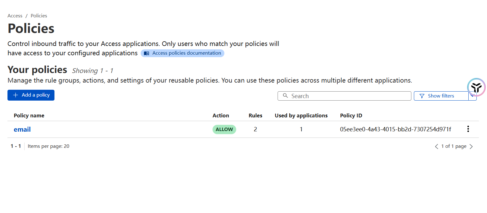
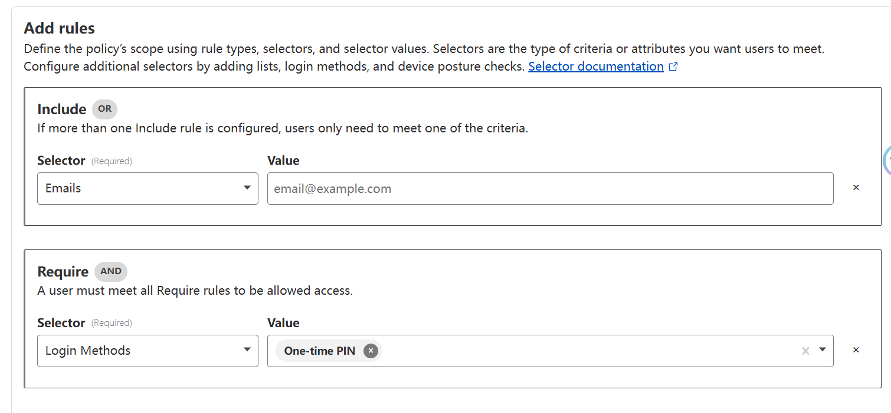

#### 1、ubuntu配置为服务器

#### 2、配置ubuntu走本机的http代理

命令行环境变量配置

```
export http_proxy="http://192.168.1.2:7890"
export https_proxy="http://192.168.1.2:7890"
```

#### 3、安装mysql、git、nodejs、curl、build-essential

* sudo apt install -y mysql-server 安装mysql

​	sudo mysql_secure_installation 初始化安全设置

​	默认sudo mysql进入mysql,没有密码

* build-essential：是 Ubuntu（以及其他 Debian 系列发行版）提供的一个“元包”（meta-package），它的作用在于一次性安装构建（编译）几乎所有本地软件包时所需的基础工具和头文件。

  curl：使用官方 NodeSource 脚本安装 LTS 版本，为了后续安装nodejs

  git：用来 **克隆 Ghost-CLI**（或 Ghost 的源码仓库）以及各类主题、插件的版本库。

  sudo apt install -y curl git build-essential

* 安装 Node.js

  ```
  # 以 Node.js 18 为例
  curl -fsSL https://deb.nodesource.com/setup_18.x | sudo -E bash -
  sudo apt install -y nodejs
  # 确认版本
  node -v    # 应为 v18.x.x
  npm -v
  npm设置代理
  npm config set proxy   "http://192.168.1.2:7890"
  npm config set https-proxy "http://192.168.1.2:7890"
  ```

####  4、 安装部署 Ghost-CLI

  sudo npm install -g ghost-cli@latest --verbose

* mysql配置ghost专有用户数据库

  ```
  CREATE DATABASE ghostdb;
  CREATE USER 'ghostuser'@'localhost' IDENTIFIED BY 'your_strong_password';
  GRANT ALL PRIVILEGES ON ghostdb.* TO 'ghostuser'@'localhost';
  FLUSH PRIVILEGES;
  EXIT;
  ```

* 部署 Ghost

  ```
  创建网站目录
  sudo chmod o+rx /home/xiaoyu #放宽家目录权限
  sudo chown -R $USER:$USER 目录 #确保你当前用户对 Ghost 安装目录有读写权限
  在该目录下运行ghost install初始化并安装 Ghost
  安装过程中:根据提示输入博客 URL、MySQL 设置 zengnui.uk
  sudo systemctl status ghost_zengnui-uk检测服务是否启动
  ghost start
  ghost stop
  ghost restart
  ghost log
  123456
  ```
  

#### 5、配置cloudflared内网穿透

下载安装cloudflared

```
wget https://github.com/cloudflare/cloudflared/releases/latest/download/cloudflared-linux-amd64.deb
sudo apt update
sudo dpkg -i cloudflared-linux-amd64.deb
# 如果有依赖缺失，再运行：
sudo apt --fix-broken install
cloudflared --version #验证安装
```

配置

```
# 会在 ~/.cloudflared 保存凭证文件
cloudflared tunnel login 打开的浏览器页面点击授权
# 创建一个名为 ghost-blog 的隧道
cloudflared tunnel create ghost-blog
```

编辑~/.cloudflared/config.yml

```
tunnel: <your-tunnel-UUID>
credentials-file: /home/youruser/.cloudflared/<your-tunnel-UUID>.json

ingress:
  - hostname: blog.example.com
    service: http://127.0.0.1:2368
    originRequest:
      noTLSVerify: true
      connectTimeout: 30s

  # 回退：其他请求返回 404
  - service: http_status:404
```

登录到cloudflare.com页面，点击域名，点击dns，添加一个cname，name设置为@即为主域名，其他为子域名，target设置为

| 类型  | 名称             | 目标                             | 代理  |
| ----- | ---------------- | -------------------------------- | ----- |
| CNAME | blog.example.com | `<tunnel-UUID>.cfargotunnel.com` | 开启🟠 |

> 问题1：当 cloudflared 在启动阶段一直拿不到 `_v2-origintunneld._tcp.argotunnel.com` 的 SRV 记录（因为它走的是 systemd-resolved 的 127.0.0.53 stub 且超时），它就认为自己无法找到任何可用的 Cloudflare Edge 节点，最终就会自行退出

编辑 `/etc/systemd/resolved.conf`：

```
[Resolve]
DNS=1.1.1.1 1.0.0.1
DNSStubListener=yes
```

sudo systemctl restart systemd-resolved重启resolver

```
resolvectl status | grep 'DNS Servers'
# 你应该能看到 1.1.1.1 1.0.0.1
```

作为系统服务自动启动

创建系统服务单元

```
[Unit]
Description=cloudflared Tunnel %i
After=network.target

[Service]
Type=simple
User=xiaoyu
Environment="TUNNEL_NAME=%i"
Environment="TUNNEL_ORIGIN_CERT=/home/xiaoyu/.cloudflared/cert.pem"
ExecStart=/usr/bin/cloudflared tunnel run "${TUNNEL_NAME}"
Restart=on-failure
RestartSec=5s

[Install]
WantedBy=multi-user.target
```


```
sudo systemctl daemon-reload
sudo systemctl enable --now cloudflared@ghost-tunnel
sudo systemctl status cloudflared@ghost-tunnel
```

#### 配置dns域名访问邮箱验证

#### ghost自定义配置

后台管理：域名/ghost 进入输入账号密码

开发者文档：https://ghost.org/docs

默认主题叫：casper

自定义主题：修改主页的.hbs文件、在后台点击自定义主题

#### ubuntu文件拖拽出现问题

更新清华源，24版本的更新源方法与之前不同

然后彻底删除open-vm-tools：sudo apt autoremove open-vm-tools

然后在安装：sudo apt install open-vm-tools open-vm-tools-desktop -y

然后在reboot

或者尝式注销后，点击用户，然后点右下角那也切换一下

#### 配置限制访问

https://dash.cloudflare.com/

进入登录后，点击域名，点击左侧面板的access，点击右侧的launch zero trust，点击access，然后点击application创建一个application，点击self host，点击Add public hostname，在domain中将域名填进去


然后点击policies,添加一个policies，



